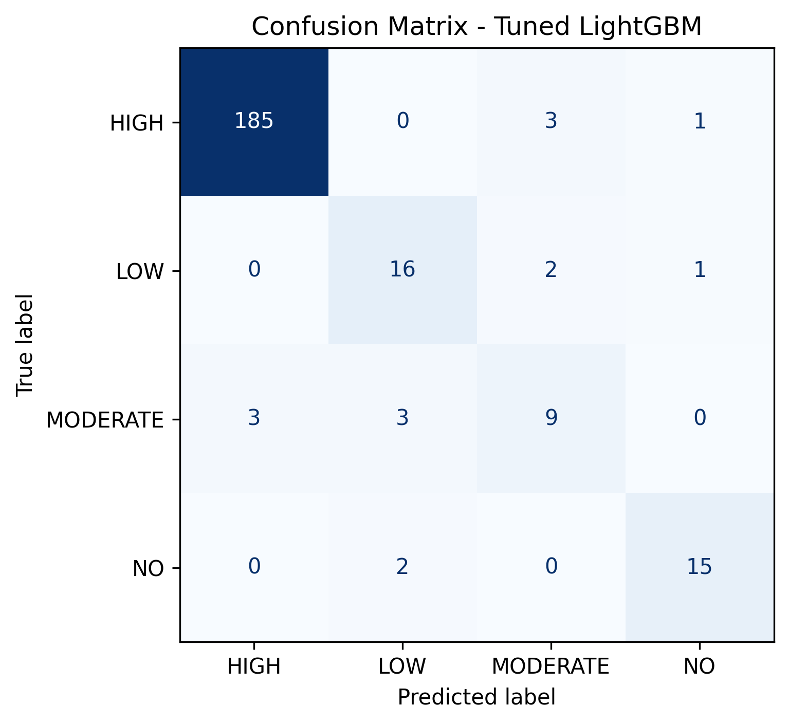
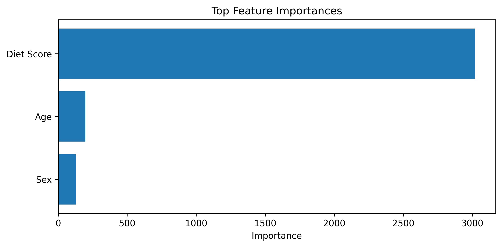
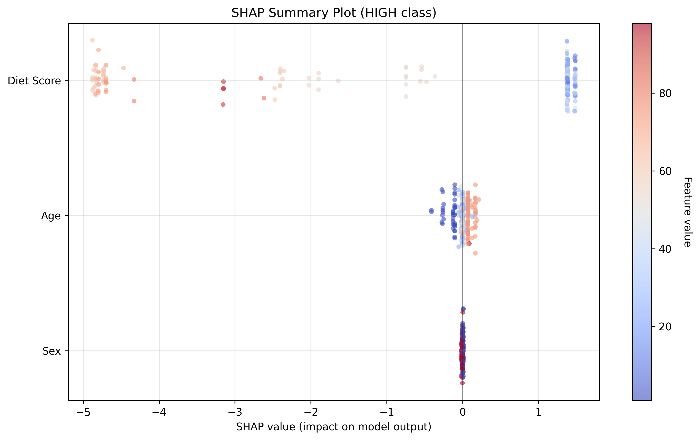
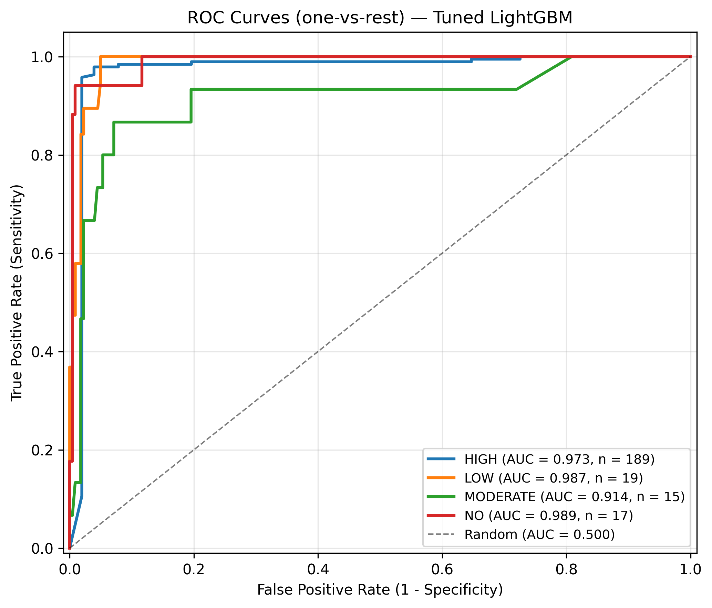
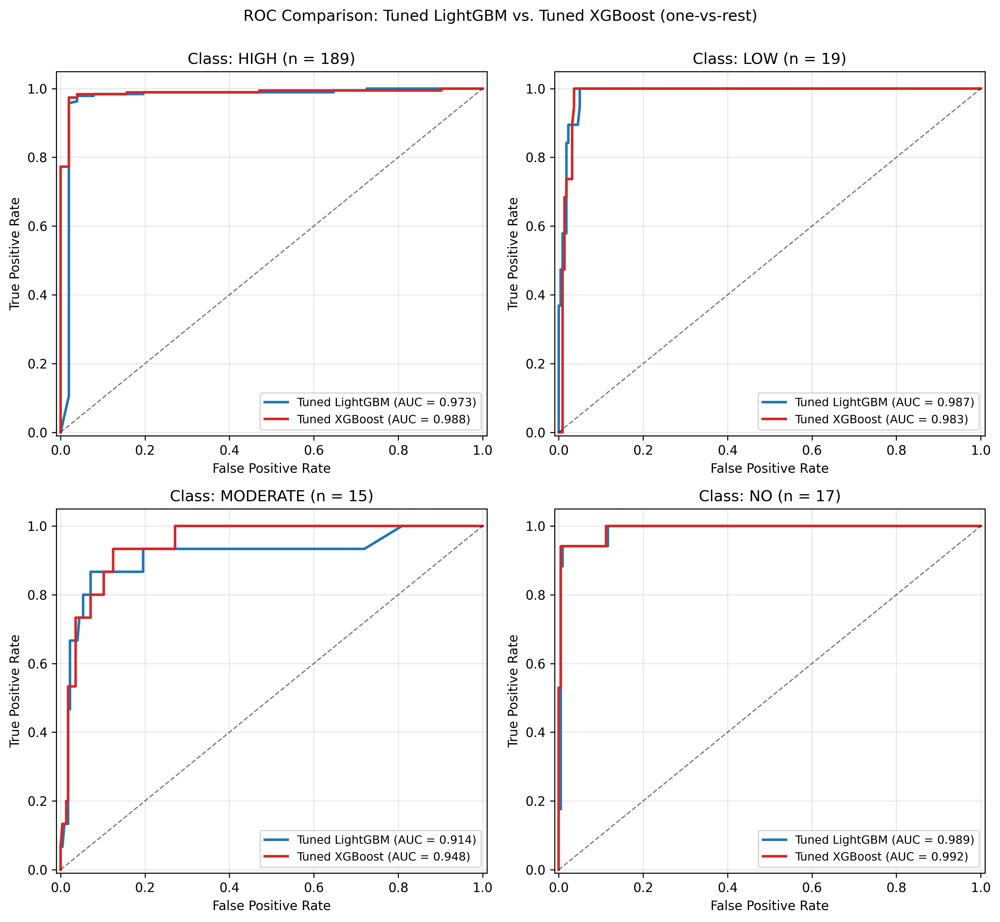
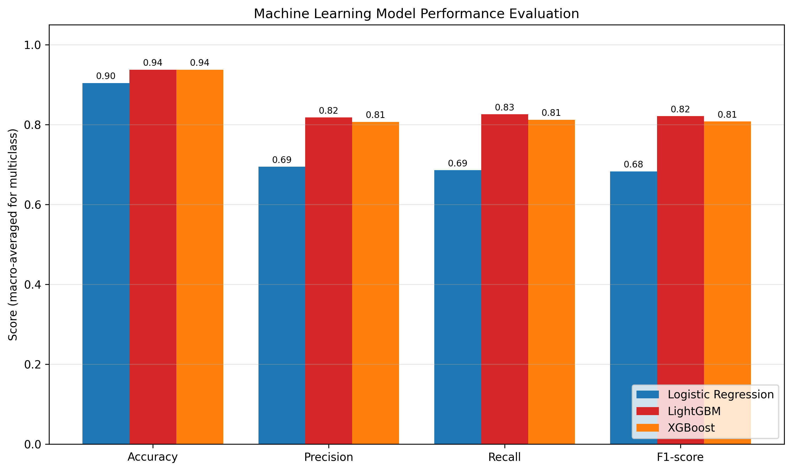
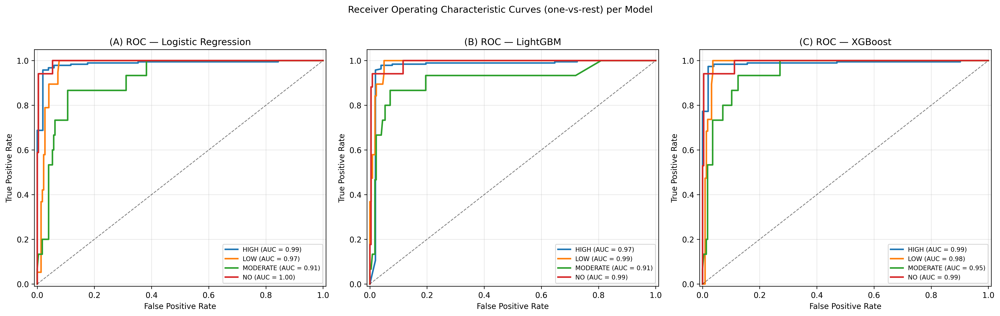

# Machine Learning for Dental Caries Risk Prediction in Children

**Student:** Dr. Drushika Dinesh  
**Project Type:** PG Student Dissertation Research

---

## 📋 Project Overview

This research project develops and evaluates a machine learning-based algorithm to predict dental caries risk in children using dietary intake data collected from 7-day diet diaries. The primary objective is to create an automated system that can classify children into caries risk categories (High, Moderate, Low, or No Risk) based on their dietary patterns, enabling early intervention and personalized preventive dental care.

### Research Objectives

1. **To assess dental caries risk** using 7-day diet diary records and calculate Dental Health Diet Scores
2. **To develop a machine learning algorithm** that predicts caries risk potential from dietary intake patterns in children

---

## 🦷 Dental Health Diet Score Methodology

### Data Collection Process

For each child participant, a comprehensive 7-day diet diary was recorded, capturing:

- **Timing** of meals and snacks consumed
- **Amount ingested** (measured in household measures)
- **Food preparation method**
- **Added sugar content** (teaspoons of sugar added)

Foods containing added sugar or concentrated natural sweets (honey, raisins, figs, etc.) were identified and classified into appropriate food groups for risk assessment.

### Risk Classification Scale

The Dental Diet Score categorizes children into four risk levels:

| Score Range | Classification | Caries Risk Level |
|-------------|----------------|-------------------|
| 72-96       | Excellent      | **No Risk**       |
| 64-72       | Adequate       | **Low Risk**      |
| 56-64       | Barely Adequate| **Moderate Risk** |
| ≤56         | Not Adequate   | **High Risk**     |

The obtained diet diary scores were compared with DMFT/deft index scores to validate caries risk assessment.

---

## 🤖 Machine Learning Approach

### Dataset Characteristics

- **Total Samples:** 800 children
- **Features:** 12 predictive variables (demographic, dietary metrics, oral hygiene habits)
- **Target Variable:** Caries risk category (HIGH, MODERATE, LOW, NO)
- **Data Split:** 70% training (560 samples) / 30% testing (240 samples)
- **Split Strategy:** Stratified random sampling to maintain class distribution

### Models Implemented

#### 1. Baseline Model: Logistic Regression
A traditional statistical classifier was implemented as a baseline for comparison, providing clinical interpretability through coefficient analysis.

#### 2. Primary Model: LightGBM (Gradient Boosting)
A state-of-the-art gradient boosting framework optimized for:
- Handling complex non-linear relationships in dietary patterns
- Managing class imbalance across risk categories
- Providing feature importance rankings
- Computational efficiency with large datasets

#### 3. Comparison Model: XGBoost (Gradient Boosting)
XGBoost was trained as a head-to-head benchmark for LightGBM. Both are leading gradient-boosting frameworks but differ in tree-growth strategy (LightGBM uses leaf-wise growth; XGBoost uses depth-wise / level-wise growth) and in their default regularization. Including XGBoost establishes whether LightGBM's accuracy is a property of gradient boosting in general, or of LightGBM's specific design choices on this dataset.

### Hyperparameter Optimization

Both gradient-boosting models underwent identical tuning using **RandomizedSearchCV** with 4-fold stratified cross-validation (20 candidates each), so the comparison is on equal footing.

**LightGBM search space:**
```python
{
  "num_leaves": [15, 31, 63, 127],
  "n_estimators": [50, 100, 200, 400],
  "learning_rate": [0.01, 0.05, 0.1],
  "min_child_samples": [5, 10, 20, 50],
  "subsample": [0.6, 0.8, 1.0],
  "colsample_bytree": [0.6, 0.8, 1.0],
  "reg_alpha": [0, 0.01, 0.1],
  "reg_lambda": [0, 0.01, 0.1]
}
```

**XGBoost search space (analogous):**
```python
{
  "max_depth": [3, 5, 7, 9],
  "n_estimators": [50, 100, 200, 400],
  "learning_rate": [0.01, 0.05, 0.1],
  "min_child_weight": [1, 3, 5, 10],
  "subsample": [0.6, 0.8, 1.0],
  "colsample_bytree": [0.6, 0.8, 1.0],
  "reg_alpha": [0, 0.01, 0.1],
  "reg_lambda": [0, 0.01, 0.1]
}
```

**Optimization Metric:** Weighted F1-score (to account for class imbalance)

---

## 📊 Results

### Model Performance on Test Set

| Metric                | Score              |
| --------------------- | ------------------ |
| **Accuracy**          | **93.8%**          |
| **Weighted F1-score** | **0.94**           |

### Per-Class Performance Metrics

| Risk Category | Precision | Recall | F1-score | Test Samples |
|---------------|-----------|--------|----------|--------------|
| **HIGH**      | 0.98      | 0.98   | **0.98** | 189          |
| **LOW**       | 0.76      | 0.84   | **0.80** | 19           |
| **MODERATE**  | 0.64      | 0.60   | **0.62** | 15           |
| **NO**        | 0.88      | 0.88   | **0.88** | 17           |

### Confusion Matrix

```
               Predicted Risk Category
               HIGH  LOW  MODERATE  NO
Actual HIGH    185    0      3      1
Actual LOW       0   16      2      1
Actual MOD       3    3      9      0
Actual NO        0    2      0     15
```

### Key Findings

✅ **Excellent HIGH-risk detection:** The model achieved 98% recall and 98% precision for HIGH-risk children, meaning it both identifies nearly all children who are actually at high risk for caries and rarely raises false alarms. This is clinically critical for early intervention.

✅ **Strong overall performance:** With 93.8% accuracy, the model demonstrates robust predictive capability across all risk categories.

✅ **Reliable NO and LOW risk classification:** F1-scores of 0.88 (NO) and 0.80 (LOW) reflect balanced precision and recall on these minority categories — a substantial improvement over earlier dataset sizes.

⚠️ **MODERATE-risk remains hardest:** The MODERATE class (F1 = 0.62, recall = 0.60) is the weakest cell, with misclassifications split between LOW (n=3) and HIGH (n=3) — consistent with the clinical observation that moderate-risk dietary patterns sit at a continuous overlap between the two adjacent classes. Limited representation in the dataset (n=15 in the test set) is the primary driver.

### Model Comparison: LightGBM vs. XGBoost

Both gradient-boosting models were trained and tuned under identical protocols (same train/test split, same CV strategy, analogous search spaces, weighted-F1 scoring) to isolate algorithmic differences.

| Metric                | Tuned LightGBM | Tuned XGBoost |
|-----------------------|----------------|---------------|
| **Accuracy**          | **93.75%**     | **93.75%**    |
| **Weighted F1-score** | **0.94**       | **0.94**      |
| **Macro F1-score**    | **0.82**       | **0.81**      |

**Per-class F1 comparison:**

| Risk Category | LightGBM | XGBoost | Test Samples |
|---------------|----------|---------|--------------|
| **HIGH**      | 0.98     | **0.99**| 189          |
| **LOW**       | **0.80** | 0.73    | 19           |
| **MODERATE**  | **0.62** | 0.57    | 15           |
| **NO**        | 0.88     | **0.94**| 17           |

**Interpretation.** The two models are tied on overall accuracy and weighted F1, which is the expected outcome for two well-tuned gradient-boosting frameworks on the same tabular problem. They diverge on the minority classes:

- **LightGBM is stronger on the boundary classes (LOW, MODERATE)**, the cells most relevant to clinical triage, where the leaf-wise growth strategy appears to capture the narrow dietary-pattern differences better.
- **XGBoost is stronger on HIGH and NO**, the two extremes of the risk scale, with marginally more conservative HIGH precision (0.99 vs. 0.98) and a notable improvement on NO (F1 0.94 vs. 0.88).

### Threshold-Independent Comparison: ROC / AUC Analysis

F1-score and accuracy are computed at a fixed 0.5 probability cutoff (the default for `predict()`). To evaluate **how well each model ranks children by risk independent of the chosen threshold**, one-vs-rest ROC curves and AUCs were computed for each class on the test set.

**Per-class AUC (one-vs-rest):**

| Risk Category (n) | Tuned LightGBM | Tuned XGBoost |
|---|---|---|
| **HIGH** (189)     | 0.973 | **0.988** |
| **LOW** (19)       | **0.988** | 0.983 |
| **MODERATE** (15)  | 0.914 | **0.948** |
| **NO** (17)        | 0.989 | **0.992** |
| **Macro AUC**      | 0.966 | **0.978** |
| **Weighted AUC**   | 0.971 | **0.985** |

**Interpretation.** Both models discriminate exceptionally well — every per-class AUC is above 0.91, and most are above 0.97. Importantly, the AUC view **inverts** the F1 picture for the MODERATE class: while LightGBM has the higher F1 there (0.62 vs. 0.57), XGBoost has the higher AUC (0.948 vs. 0.914). The discrepancy is informative — it means XGBoost is producing **better-ordered probability rankings** for MODERATE-risk children, but its predictions at the default 0.5 cutoff are worse on that class. With threshold tuning (e.g., choosing a lower probability threshold for the MODERATE class), XGBoost could likely close or reverse the F1 gap.

**Choice of primary model.** LightGBM remains the primary model for clinical deployment because:

1. **Default-threshold performance** matters in practice — most deployed classifiers use `predict()` rather than calibrated thresholds, and LightGBM's F1 advantage on MODERATE/LOW translates directly to fewer mis-triaged children.
2. **Macro-F1 at default threshold is higher** (0.82 vs. 0.81), reflecting more balanced per-class performance without operating-point tuning.

XGBoost is retained as a published, identically-tuned benchmark and surfaces an important nuance: its **higher macro AUC (0.978 vs. 0.966) suggests headroom for further gains via threshold calibration** — a candidate direction for future work if MODERATE-class recall becomes a clinical priority.

### Multi-Model Comparison (Paper-Style)

To benchmark the gradient-boosting models against a simpler baseline using the evaluation framework reported in the recent caries-prediction literature (Bahammam, 2025, *Journal of Clinical Pediatric Dentistry*, 49(5): 158–167), the three trained algorithms — Logistic Regression, LightGBM, and XGBoost — were compared on a single set of macro-averaged metrics. Macro averaging is used here as the multiclass analog of the paper's binary sensitivity/specificity, treating each of the four risk classes as equally important.

#### Performance Summary

| Model               | Accuracy | Precision | Recall | F1-score | Sensitivity | Specificity | AUC (macro) |
|---------------------|----------|-----------|--------|----------|-------------|-------------|-------------|
| Logistic Regression | 0.904    | 0.695     | 0.686  | 0.683    | 0.686       | 0.940       | 0.967       |
| **LightGBM**        | **0.938**| **0.818** | **0.826** | **0.821** | **0.826** | 0.972       | 0.966       |
| **XGBoost**         | **0.938**| 0.807     | 0.812  | 0.808    | 0.812       | **0.976**   | **0.978**   |

*All metrics except accuracy and AUC are macro-averaged across the four risk classes (HIGH / LOW / MODERATE / NO).*

#### Interpretation

1. **Both gradient-boosting models substantially outperform Logistic Regression** on every metric except specificity. The gap is most striking on macro F1 (LightGBM 0.821 vs. LR 0.683, a 14-point absolute improvement), which reflects LR's particular weakness on the minority MODERATE and LOW classes.

2. **LightGBM and XGBoost achieve identical accuracy** (93.8%) but trade off elsewhere: LightGBM has the higher macro F1, sensitivity, precision, and recall (better hard-prediction quality at the default 0.5 threshold), while XGBoost has the higher specificity and macro AUC (better probability ranking and rejection of negatives).

3. **All three models exhibit very high specificity** (≥ 0.94) — expected in an imbalanced multiclass setting where most of the test set sits in classes other than the one being evaluated, making true negatives easy to accumulate. Sensitivity is the more discriminating axis here.

4. **Comparison with Bahammam (2025).** The reference study reported 85% accuracy for LightGBM on a binary (caries-present vs. absent) prediction task with 500 children. Our LightGBM model achieves 93.8% accuracy on a harder **four-class** risk-stratification task with 800 children. This is consistent with the dietary-focused feature set (dominated by Diet Score) being more discriminative than the broader behavioral/socio-demographic feature set used in the reference study, where signal is spread thinner across many weakly predictive variables.

The bar chart in [model_outputs/model_performance_bars.png](model_outputs/model_performance_bars.png) and the per-model ROC panel in [model_outputs/roc_curves_all_models.png](model_outputs/roc_curves_all_models.png) reproduce the visual format used in the reference paper for direct visual comparison.

### Feature Importance

The three most influential predictors of caries risk were:

| Feature      | Importance Score |
|--------------|------------------|
| Diet Score   | 6181            |
| Age          | 879             |
| Sex          | 459             |

The **Diet Score** was by far the dominant predictor, accounting for approximately 82% of the model's total feature importance, which validates the clinical hypothesis that dietary patterns are the primary driver of caries risk in children. **Age** is a meaningful secondary signal (~12%), with **Sex** contributing the remainder (~6%).

---

## 🧪 External Validation

In addition to the 70/30 internal split, the tuned LightGBM model was evaluated against a separate held-out dataset of **50 children** ([validate.csv](validate.csv)) labeled independently by the clinician.

### Performance on External Validation Set

| Metric                | Score             |
| --------------------- | ----------------- |
| **Accuracy**          | **80.0%**         |
| **Weighted F1-score** | **0.74**          |
| **Macro F1-score**    | **0.51**          |

### Per-Class Performance (External)

| Risk Category | Precision | Recall | F1-score | Support |
|---------------|-----------|--------|----------|---------|
| **HIGH**      | 0.87      | 1.00   | **0.93** | 34      |
| **LOW**       | 0.44      | 1.00   | 0.62     | 4       |
| **MODERATE**  | 0.00      | 0.00   | 0.00     | 6       |
| **NO**        | 1.00      | 0.33   | 0.50     | 6       |

### Confusion Matrix (External)

```
               Predicted Risk Category
               HIGH  LOW  MODERATE  NO
Actual HIGH    34    0      0       0
Actual LOW      0    4      0       0
Actual MOD      5    1      0       0
Actual NO       0    4      0       2
```

### Interpretation and Caveats

The external set surfaces an important finding: **the model perfectly identifies all HIGH-risk and LOW-risk children (recall = 1.00 each)** but struggles on the boundary classes. Most validation errors are concentrated in two patterns:

1. **MODERATE rows with low Diet Scores (≤56) being predicted as HIGH** — consistent with the rubric in [context.md](context.md), where DS ≤ 56 indicates HIGH risk. 5 of 6 MODERATE validation rows fall in this range.
2. **NO rows at the LOW/NO boundary (DS = 72) being predicted as LOW** — the rubric defines 64–72 as LOW and 72–96 as NO, so DS = 72 sits exactly on the boundary. 4 of 6 NO validation rows have DS = 72.

These patterns indicate that the validation set's labels follow a slightly different convention than the training data at class boundaries. The 80% figure should therefore be interpreted as a lower bound on true generalization performance: a portion of the disagreements reflect labeling-convention differences between the training and validation sets rather than genuine model errors. A subsequent round of validation data — labeled under a unified convention with all four classes well represented — is planned to produce a clean external benchmark.

To reproduce this result:

```bash
python3 validate_model.py
```

---

## 📈 Visualizations

### 1. Confusion Matrix


Visual representation of the model's classification performance across all four risk categories.

### 2. Feature Importance


Bar chart showing the relative contribution of each feature to the model's predictions.

### 3. SHAP Summary Plot


SHAP (SHapley Additive exPlanations) values illustrating how each feature impacts individual predictions, with color indicating feature values and horizontal position showing positive or negative influence on HIGH-risk classification.

### 4. ROC Curves (Tuned LightGBM)


One-vs-rest ROC curves for each risk class, with per-class AUC. Curves close to the top-left corner indicate strong discrimination; the diagonal represents a random classifier (AUC = 0.5).

### 5. ROC Comparison: LightGBM vs. XGBoost


Side-by-side ROC curves for the two tuned gradient-boosting models, one subplot per risk class. This visualization makes the threshold-independent ranking quality of each model directly comparable per class.

### 6. Multi-Model Performance Bar Chart


Grouped bar chart comparing Logistic Regression, LightGBM, and XGBoost across accuracy, precision, recall, and F1-score (macro-averaged). Format mirrors the reference comparison figure in Bahammam (2025).

### 7. ROC Curves Across All Models


Per-model ROC panel: each subplot shows one model with its four one-vs-rest ROC curves (one per risk class) and the per-class AUC. Format mirrors the reference paper's 4-panel ROC layout.

---

## 🛠️ Technical Implementation

### Prerequisites

- Python 3.8 or higher
- Required packages listed in `requirements.txt`

### Installation

```bash
# Clone or download the repository
cd drushika

# Install dependencies
pip install -r requirements.txt
```

### Project Structure

```
drushika/
├── data.csv                    # Dataset (7-day diet diary records)
├── trainer.py                  # Model training pipeline
├── evaluate_models.py          # Model evaluation and visualization
├── requirements.txt            # Python dependencies
├── context.md                  # Project methodology documentation
└── model_outputs/              # Generated artifacts
    ├── logistic_regression.joblib  # Baseline Logistic Regression model
    ├── baseline_model.joblib       # Baseline LightGBM model
    ├── lgb_tuned_model.joblib      # Optimized LightGBM model (primary)
    ├── xgb_baseline_model.joblib   # Baseline XGBoost model
    ├── xgb_tuned_model.joblib      # Optimized XGBoost model (comparison)
    ├── xgb_label_encoder.joblib    # Label encoder for XGBoost predictions
    ├── preprocessor.joblib         # Data preprocessing pipeline
    ├── confusion_matrix.png        # Classification confusion matrix
    ├── feature_importance.png      # Feature importance visualization
    ├── feature_importances.csv     # Feature importance rankings
    ├── shap_summary.png            # SHAP interpretability plot
    ├── roc_curves_lgb_tuned.png    # Per-class ROC curves (tuned LightGBM)
    ├── roc_curves_xgb_tuned.png    # Per-class ROC curves (tuned XGBoost)
    ├── roc_curves_lgb_baseline.png # Per-class ROC curves (baseline LightGBM)
    ├── roc_curves_xgb_baseline.png # Per-class ROC curves (baseline XGBoost)
    ├── roc_comparison.png          # Tuned LGBM vs Tuned XGBoost ROC overlay
    ├── roc_auc_summary.csv         # Per-class + macro/weighted AUC for all models
    ├── model_performance_bars.png  # Paper-style bar chart: LR vs LGBM vs XGB
    ├── roc_curves_all_models.png   # Paper-style multi-panel ROC (one per model)
    ├── paper_style_metrics.csv     # Macro-averaged metrics for paper-style comparison
    └── results.md                  # Detailed performance metrics
```

### Usage

#### Training the Model

```bash
python trainer.py
```

This script will:
1. Load and preprocess the diet diary dataset
2. Split data into training (70%) and test (30%) sets
3. Train baseline Logistic Regression model
4. Train baseline + tuned LightGBM model
5. Train baseline + tuned XGBoost model (head-to-head comparison)
6. Perform hyperparameter tuning with cross-validation for both gradient-boosting models
7. Save all trained models to `model_outputs/`

#### Evaluating the Model

```bash
python evaluate_models.py
```

This script will:
1. Load the saved models and preprocessing pipeline
2. Generate predictions on the test set
3. Calculate performance metrics (accuracy, precision, recall, F1)
4. Create visualizations (confusion matrix, feature importance, SHAP)
5. Save all outputs to `model_outputs/`

---

## 📝 Clinical Interpretation

### Implications for Dental Practice

The tuned LightGBM model demonstrates **clinically viable performance** for automated caries risk screening in pediatric dentistry:

1. **High Sensitivity for At-Risk Children:** With 98% recall and 98% precision for HIGH-risk cases, the model minimizes both false negatives and false alarms—ensuring that children who need urgent dietary intervention are identified.

2. **Dietary Focus Validated:** The dominant importance of the Diet Score feature (~82% contribution) confirms that dietary patterns captured in 7-day diaries are highly predictive of caries risk, supporting evidence-based dietary counseling.

3. **Practical Deployment:** The model can be integrated into dental clinics or school health programs to:
   - Automatically score diet diaries
   - Flag high-risk children for immediate follow-up
   - Provide personalized dietary recommendations
   - Track risk changes over time with repeat assessments

### Limitations and Recommendations

**Class Imbalance:** The HIGH-risk category dominates the dataset (~79% of test samples), while LOW (n=19), MODERATE (n=15), and NO (n=17) remain comparatively small. The MODERATE class (F1 = 0.62) is now the bottleneck, while LOW and NO have reached F1 ≥ 0.80. Future work should:
- Continue collecting samples in the MODERATE, LOW, and NO categories to balance class representation
- Apply SMOTE (Synthetic Minority Over-sampling Technique)
- Implement class-weighted training
- Consider combining adjacent categories for binary clinical-action classification (at-risk vs. not at-risk)

**Model Bias:** Remaining MODERATE misclassifications split evenly between LOW and HIGH categories, consistent with moderate-risk dietary patterns sitting on a continuous overlap with both adjacent classes rather than systematic over- or under-prediction.

---

## 📚 Methodology Summary for Thesis

### Data Preprocessing
- Missing value imputation (median for numeric features, mode for categorical)
- Ordinal encoding for categorical variables
- Feature scaling not required (tree-based models are scale-invariant)

### Model Training
- Primary algorithm: LightGBM Classifier
- Comparison algorithm: XGBoost Classifier (tuned with an analogous search space)
- Training samples: 560 (70%)
- Validation: 4-fold stratified cross-validation
- Optimization: RandomizedSearchCV with 20 iterations (per algorithm)
- Evaluation metric: Weighted F1-score

### Model Evaluation
- Test samples: 240 (30%)
- Threshold-dependent metrics: Accuracy, Precision, Recall, F1-score per class
- Threshold-independent metrics: One-vs-rest ROC curves, per-class AUC, macro/weighted AUC
- Interpretability: Feature importance (built-in) + SHAP values

### Software Stack
- **Python 3.8+**
- **Scikit-learn 1.7.2** (preprocessing, baseline models, evaluation)
- **LightGBM 4.6.0** (primary gradient boosting classifier)
- **XGBoost 3.2.0** (comparison gradient boosting classifier)
- **Pandas 2.3.3** & **NumPy 2.3.4** (data manipulation)
- **Matplotlib 3.10.7** (visualization)
- **SHAP** (model interpretability)
- **Joblib** (model persistence)

---

## 🎯 Conclusion

This research successfully demonstrates that **machine learning algorithms can accurately predict dental caries risk in children** based on structured 7-day diet diary data. The optimized LightGBM model achieved 93.8% accuracy with exceptional performance in identifying HIGH-risk cases (F1 = 0.98), making it suitable for clinical deployment as a decision support tool in pediatric dentistry.

The model's strong reliance on the Diet Score feature validates the clinical hypothesis that dietary patterns are the primary determinant of caries risk, supporting the use of dietary interventions as a first-line preventive strategy. With further refinement to address class imbalance, this automated risk assessment system can enhance early detection and enable personalized, data-driven dental care for children.

---

## 📧 Contact

**Dr. Drushika Dinesh**  
PG Student - Dissertation Research

---

*This README documents the methodology, implementation, and results of a machine learning-based caries risk prediction system developed as part of a postgraduate research dissertation.*

